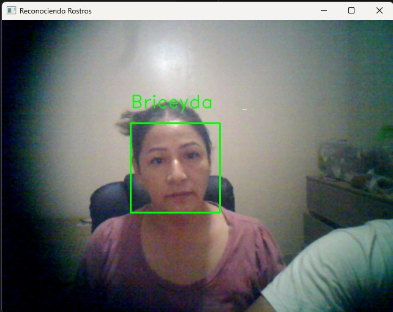
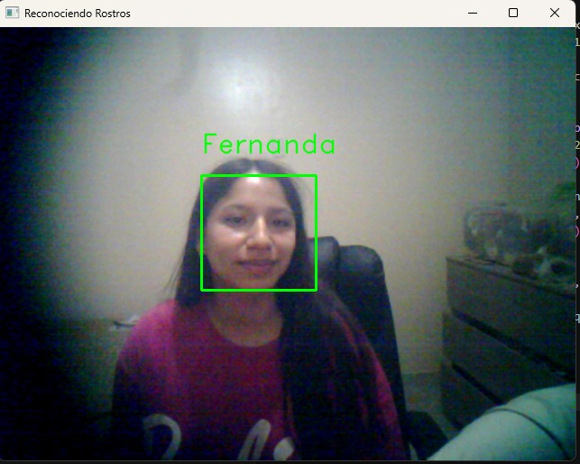
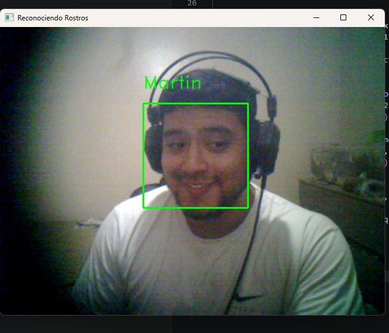

# 📌 Detector y Reconocimiento Facial - SENATI

Sistema de **detección y reconocimiento facial en tiempo real** desarrollado en Python utilizando OpenCV.
Permite registrar rostros, entrenar un modelo y reconocer personas mediante una cámara web.

---

## 🚀 Características

* 📷 Captura de rostros desde webcam
* 🧠 Entrenamiento de modelo con algoritmo LBPH
* 👤 Reconocimiento facial en tiempo real
* 📁 Almacenamiento de dataset por persona
* 🔍 Identificación de rostros conocidos y desconocidos

---

## 🛠️ Tecnologías utilizadas

* Python
* OpenCV (`opencv-python`, `opencv-contrib-python`)
* Haar Cascade
* LBPH Face Recognizer

---

## 📂 Estructura del proyecto

```
detector_facial_senati-main/
│
├── data/                      
├── detector_de_rostro.py      
├── clasificador_de_rostros.py 
├── modelo.xml                 
├── rostros.xml                
├── camera.py                  
├── assets/        # 👈 aquí van tus imágenes
└── README.md
```

## ▶️ Uso

### 1️⃣ Registrar rostro

```
python detector_de_rostro.py
```

### 2️⃣ Reconocer rostro

```
python clasificador_de_rostros.py
```

---

## 📸 Evidencias

<p align="center">
  
  
  
</p>
---

## ⚠️ Requisitos

* Python 3.x
* Cámara web funcional
* Iluminación adecuada

---

## 📌 Mejoras futuras

* Integración con base de datos
* Sistema de asistencia automática
* Interfaz web

---

## 👨‍💻 Autor

**Martin Rimachi**
Proyecto académico - SENATI

---

